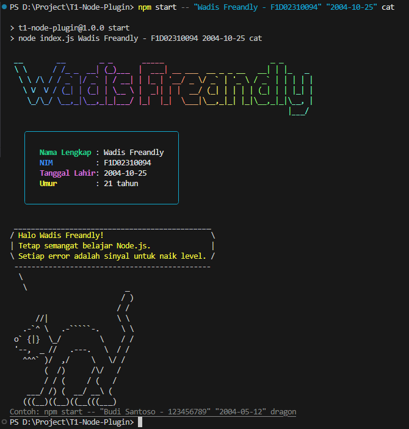
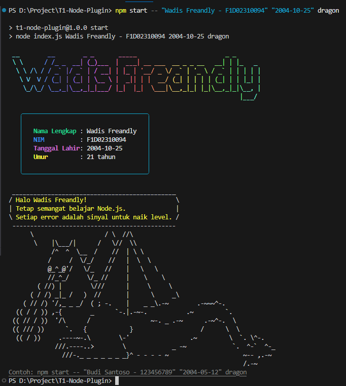
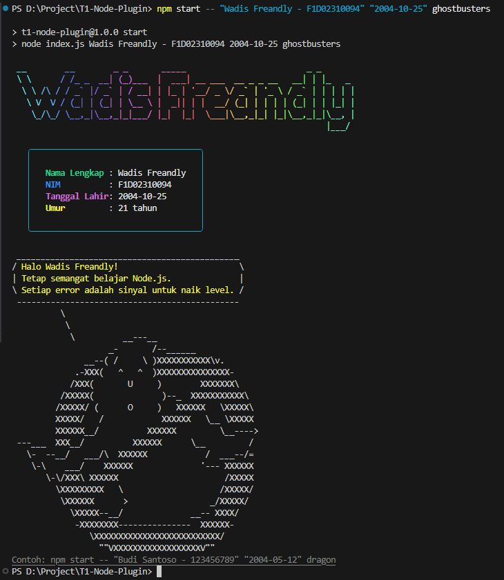

# T1-Node-Plugin

Tugas 1 Node.js Plugins menggunakan `chalk`, `cowsay`, dan `figlet`.

Project ini menggunakan format **ESModule** secara konsisten dengan `import`.

## Instruksi tugas

Script utama ada di `index.js` dan menampilkan:

- Nama lengkap dan NIM dengan warna dari `chalk`.
- Pesan motivasi melalui `cowsay`.
- Nama dalam bentuk ASCII art memakai `figlet`.
- Tampilan tambahan memakai `gradient-string`, `boxen`, dan `dayjs`.

## Instalasi dependensi

```bash
npm install
```

Atau pasang manual package yang digunakan:

```bash
npm install chalk cowsay figlet gradient-string boxen dayjs
```

## Cara menjalankan project

Jalankan dengan data default:

```bash
npm start
```

Jalankan dengan input dari terminal:

```bash
npm start -- "Nama Lengkap - NIM" "YYYY-MM-DD" dragon
```

Contoh:

```bash
npm start -- "Budi Santoso - 123456789" "2004-05-12" dragon
```

## Package yang digunakan

- `chalk`: memberi warna dan style pada output console.
- `figlet`: membuat teks besar dalam bentuk ASCII art.
- `cowsay`: membuat balon percakapan di console.
- `gradient-string`: memberi gradasi warna pada ASCII art.
- `boxen`: membungkus data identitas dalam kotak.
- `dayjs`: menghitung umur dari tanggal lahir.

## Optional enhancements

- Menerima input argumen dari terminal melalui `process.argv`.
- Menggunakan lebih dari satu warna, `bold`, dan `underline` dari `chalk`.
- Menggunakan karakter `dragon` dari `cowsay`.
- Menambahkan package `gradient-string` dan `boxen`.
- Menggunakan `dayjs` untuk menghitung umur dari tanggal lahir.

## Screenshot output

Screenshot output disimpan di folder `screenshot/`.




